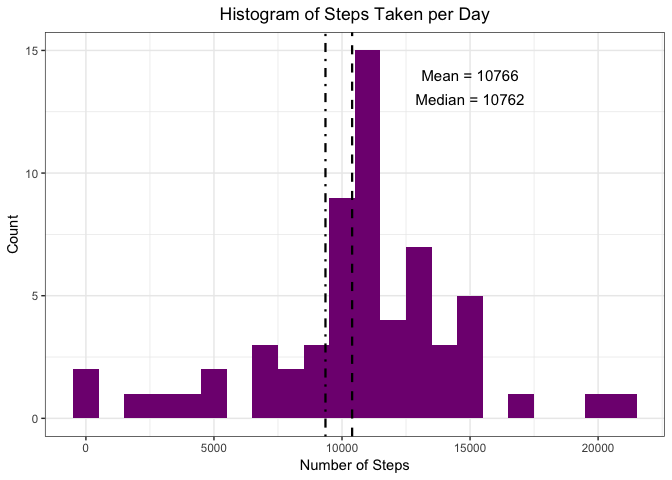

# Reproducible Research: Peer Assessment 1


## Loading and preprocessing the data

Loading any packages to be used in this report:

```r
require(dplyr)
require(ggplot2)
require(lubridate)

#set options to not represent numbers in scientific notation 
options(scipen=999)
```
  
Loading the data from a file in the current working directory:  

```r
data <- read.csv(file="activity.csv")
```
  
Look at the distribution of the data:

```r
summary(data)
```

```
##      steps                date          interval     
##  Min.   :  0.00   2012-10-01:  288   Min.   :   0.0  
##  1st Qu.:  0.00   2012-10-02:  288   1st Qu.: 588.8  
##  Median :  0.00   2012-10-03:  288   Median :1177.5  
##  Mean   : 37.38   2012-10-04:  288   Mean   :1177.5  
##  3rd Qu.: 12.00   2012-10-05:  288   3rd Qu.:1766.2  
##  Max.   :806.00   2012-10-06:  288   Max.   :2355.0  
##  NA's   :2304     (Other)   :15840
```
  
There are 2304 NA values in the steps field.
  
Converting the date to a date class object using Lubridate:

```r
data$date <- ymd(data$date)
```


## What is mean total number of steps taken per day?
  
We are going to be looking at the steps per day. Using dplyr to sum the number of steps per day (excluding NA values):

```r
steps.per.day <- data %>%
  group_by(date) %>%
  summarise(total.steps = sum(steps, na.rm=TRUE)) %>%
  ungroup
```

  
Histogram of the total number of steps taken each day:

```r
#calculate the mean and median number of steps 
mean.val <- round(mean(steps.per.day$total.steps))
median.val <- round(median(steps.per.day$total.steps))

ggplot(steps.per.day, aes(total.steps)) + 
  geom_histogram(fill="#800080", binwidth=1000) + 
  theme_bw() + 
  geom_vline(xintercept=mean.val,linetype=4, size=0.8, colour="black") +
  geom_vline(xintercept=median.val,linetype=2, size=0.8, colour="black") +
  ggtitle("Histogram of Steps Taken per Day")+
  xlab("Number of Steps") +
  ylab("Count") +
  theme(plot.title = element_text(hjust = 0.5)) +
  annotate(geom="text", x = 17000, y = 9, label = paste("Mean =",mean.val), size=4)+
  annotate(geom="text", x = 17000, y = 8.4, label = paste("Median =",median.val), size=4)
```

<!-- -->
  
Mean and Median Values:    
As represented on the graph above the mean number of steps per day is **9354** and the median is **10395** steps.
    
    
      
## What is the average daily activity pattern?
  
We are going to be looking at the average number of steps per 5 minute interval. Using dplyr to average the number of steps per interval (excluding NA values): 


```r
avg.steps.per.interval <- data %>%
  group_by(interval) %>%
  summarise(avg.steps = mean(steps, na.rm=TRUE)) %>%
  ungroup
```


Time series plot of the average number of steps taken per 5-minute interval:

```r
#Find maximum value for average number of steps 
max.val <- max(avg.steps.per.interval$avg.steps)
interval.for.max.avg <- avg.steps.per.interval$interval[which(avg.steps.per.interval$avg.steps==max.val)]

ggplot(avg.steps.per.interval, aes(interval, avg.steps)) + 
  geom_line(colour="#800080") + 
  theme_bw() + 
  ggtitle("Time Series - Average Number of Steps per 5-minute Interval")+
  xlab("5-minute Interval") +
  ylab("Average Number of Steps") +
  theme(plot.title = element_text(hjust = 0.5)) +
  geom_point( x=interval.for.max.avg , y = max.val, colour="red3") +
  annotate(geom="text", x = 1200, y = 187, label = paste("Average steps: ", round(max.val), "
  At time interval: ", interval.for.max.avg), size=4, colour="red3")
```

<!-- -->

Maximum Average Steps:    
As represented on the graph above the maximum average steps per time interval is  **206** this occurred in the time interval **835**.

## Imputing missing values

As mentioned at the beginning of this document the number of missing (NA) values are:

```r
length(which(is.na(data$steps)))
```

```
## [1] 2304
```


In this report I am going to impute any missing values with the average value found for the specific time interval. 

To do this I am joining the original data to the avg.steps.per.interval data I created by the interval.   

```r
impute.vals <- left_join(data, avg.steps.per.interval, by = c("interval"="interval"))
```
  
For the rows that contain NA step values I will replace the NAs with the **rounded** value of the average steps column that was introduced by the join above.   


```r
# for the indices of the rows with missing values, replace these step values with 
# the rounded number of average  steps from the same row indicies. 
impute.vals$steps[which(is.na(impute.vals$steps))] <- round(impute.vals$avg.steps[which(is.na(impute.vals$steps))])
```

Remove the average values to return the new data set with imputed step values:


```r
newData <- impute.vals[,1:3]
```

Remaking the histogram from before with new values of mean and median. First require us to recalculate the number of steps per day:

```r
#Over-writing the dataframe created before
steps.per.day <- newData %>%
  group_by(date) %>%
  summarise(total.steps = sum(steps, na.rm=TRUE)) %>%
  ungroup
```

The updated Histogram with the new mean and median values:

```r
#calculate the mean and median number of steps 
new.mean.val <- round(mean(steps.per.day$total.steps))
new.median.val <- round(median(steps.per.day$total.steps))

ggplot(steps.per.day, aes(total.steps)) + 
  geom_histogram(fill="#800080", binwidth=1000) + 
  theme_bw() + 
  geom_vline(xintercept=mean.val,linetype=4, size=0.8, colour="black") +
  geom_vline(xintercept=median.val,linetype=2, size=0.8, colour="black") +
  ggtitle("Histogram of Steps Taken per Day")+
  xlab("Number of Steps") +
  ylab("Count") +
  theme(plot.title = element_text(hjust = 0.5)) +
  annotate(geom="text", x = 15000, y = 14, label = paste("Mean =",new.mean.val), size=4)+
  annotate(geom="text", x = 15000, y = 13, label = paste("Median =",new.median.val), size=4)
```

<!-- -->


Compare the previous mean and median to the new ones: 

```r
Without.Imputed.Values <- rbind(mean.val,median.val)
With.Imputed.Values <- rbind(new.mean.val,new.median.val)

Table <- as.data.frame(cbind(Without.Imputed.Values, With.Imputed.Values))

names(Table) <- c("Without.Imputed.Values", "With.Imputed.Values")

Table
```

```
##            Without.Imputed.Values With.Imputed.Values
## mean.val                     9354               10766
## median.val                  10395               10762
```

  
We can see that both the mean and median have increased understandably since we are adding in values that are not likely to be 0s. The mean and median values are much closer together than they were before values were imputed. 


## Are there differences in activity patterns between weekdays and weekends?


Using the new data with imputed step values. First we will create a weekday flag:


```r
newData$weekday <- weekdays(newData$date)
```

Convert these weekdays to weekday or weekend:

```r
newData$weekpart <- ifelse(newData$weekday %in% c("Saturday", "Sunday"), "weekend", "weekday")
```

Find the average number of steps per time interval for weekdays and weekends (using dplyr):

```r
avg.steps <- newData %>%
  group_by(interval, weekpart) %>%
  summarise(avg.steps = mean(steps)) %>%
  ungroup
```


Show these average step values in a panel plot:

```r
ggplot(avg.steps, aes(interval, avg.steps)) + 
  geom_line(colour="#800080") + 
  theme_bw() + 
  ggtitle("Average Number of Steps per 5-minute Interval
  Split by Weekend and Weekday")+
  xlab("5-minute Interval") +
  ylab("Average Number of Steps") +
  theme(plot.title = element_text(hjust = 0.5))+
  facet_wrap(~ weekpart, ncol=1)
```

<!-- -->


